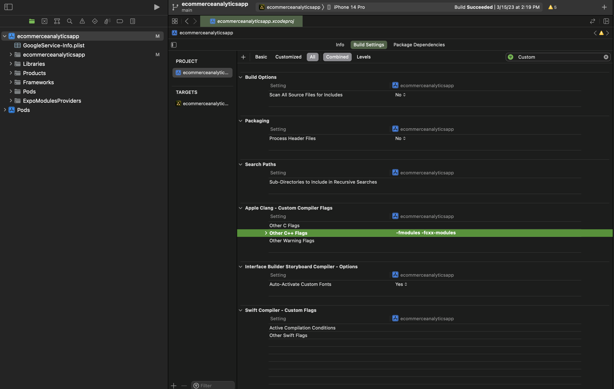

# Adobe Analytics

## NPM Package

The npm package used to support Adobe Analytics for React Native applications is: `@adobe/react-native-aepcore`. This package supports the Adobe Analytics 3.x environmental setup. Documentation for this package can be found [here](https://www.npmjs.com/package/@adobe/react-native-aepcore).

## Adobe Analytics Workspace

The Adobe Analytics Workspace dashboard is where our React Native project analytics data is collected.

<!-- Add images and more detail here as needed -->

## Adobe Analytics Data Collection

Dimensions can be added to more accurately track analytic metrics. Reach out to a member of the Analytics & Optimizations Team for more guidance if you need to verify analytic calls through the Adobe Analytics Workspace.

<!-- Add images and more detail here as needed -->

## iOS Installation

Currently, React Native Expo does not support Adobe Analytic module builds on iOS. However, they are working on it and the instructions below can be followed to add the Adobe Analytics implementation.

A newly initialized React Native app uses Objective-C for its native iOS language by default. As mentioned in the AEP (Adobe Experience Platform) Data Collection Mobile Install Instructions, you will need to add the following native language app initialization code within the `AppDelegate.mm` file in order to add Adobe Analytics.

It is important to remove the Environment File ID from the application code and keep it secret within a `.env` file. Therefore, on the line of code that configures MobileCore with the App ID, use Config to access application secrets, like so: `[AEPMobileCore configureWithAppId: [RNCConfig envFor:@"ADOBE_LAUNCH_KEY"]];`. You will also need to add the following: `#import "RNCConfig.h"` in order to use the RNCConfig module.

Additional details for using `react-native-config` can be found in the packages [README](https://github.com/luggit/react-native-config)

Add the dependencies listed in from the AEP (Adobe Experience Platform) Data Collection Mobile Install Instructions to the ios directories `Podfile`. When pods are installed, ensure the Adobe Analytic pods that are listed here are included in your `Podfile.lock`, and the application can build on iOS devices.

If you are encountering a build error, open the project in Xcode, using the project workspace `ecommerceanalyticsapp.xcworkspace`. Located in the package contents for `ecommerceanalyticsapp.xcodeproj` is the `project.pbxproj` file. Add the flags "-fmodules", "-fcxx-modules" to buildSettings for all the builds (Release, Debug, etc) in order to allow our Objective-C files to be able to consume the module imports in `AppDelegate.mm`.

## Android Installation

A newly initialized React Native app uses Java for its native Android language by default. As mentioned in the AEP (Adobe Experience Platform Data Collection) Mobile Install Instructions, you will need to add the following native language app initialization code to the `MainApplication.java` file in order to add Adobe Analytics.

It is important to remove the Environment File ID from the application code and keep it secret within a `.env` file. Therefore, on the line of code that configures MobileCore with the App ID, use BuildConfig to access application secrets, like so: `MobileCore.configureWithAppID(BuildConfig.ADOBE_LAUNCH_KEY);`

Include the dependency implementations provided by the AEP Mobile Install Instructions to your projects `build.gradle` file, located at `android > app > build.gradle`. Once added, run `yarn android` to ensure that Android is build with Adobe Analytics.
