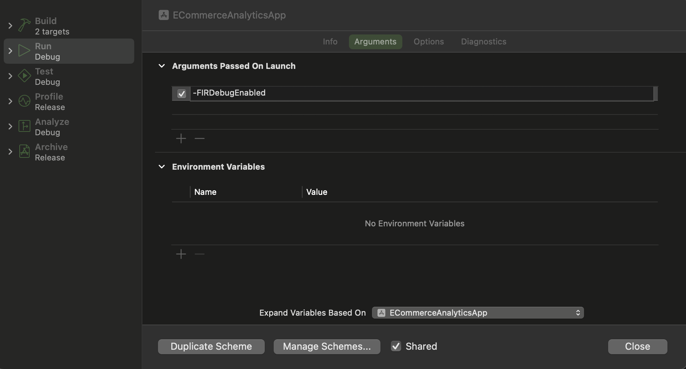
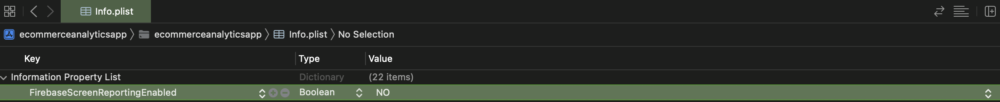

# GA4

As per the [Expo Using Analytics](https://docs.expo.dev/guides/using-analytics/) documentation, GA4 can be installed following the documentation found [here](https://rnfirebase.io/analytics/usage).

This module requires that the `@react-native-firebase/app` module is already setup and installed. To install the "app" module, view the [Getting Started](https://rnfirebase.io/) documentation.

React Native Firebase documentation is rather thorough. There are even supporting docs for Typescript. 


## Firebase DebugView



For iOS, open Xcode via the project workspace - `ecommerceanalyticsapp.xcworkspace`. Then go to Product -> Scheme -> Edit Scheme. 
Add the following argument to 'Arguments Passed On Launch' in the Run -> Arguments section.

```
-FIRDebugEnabled
```


## "Automatic" Screen View Tracking



For iOS, open Xcode via the [project workspace](../../../expo/ios/ecommerceanalyticsapp.xcworkspace/contents.xcworkspacedata) file - `ecommerceanalyticsapp.xcworkspace`. Open the file, `info.plist` and add the following setting:
```
FirebaseScreenReportingEnabled to NO (Boolean)
```

For Android, nest the following setting within the `<application>` tag of the main `AndroidManifest.xml` file:

```
<meta-data android:name="google_analytics_automatic_screen_reporting_enabled" android:value="false" />
```


## Gotchas

- You cannot send PII (personally identifiable information) such as name or email to GA4

- GA4 expects specific formatting for it's e-commerce analytics. Refer to [GA4 Docs](https://developers.google.com/analytics/devguides/collection/ga4/reference/events?client_type=gtag#view_item_list) for details.

- If you are making a custom dimension, use string values. For example, when attempting to track a boolean value for isAuthenticated, GA4 did not set the boolean for the unique key "logged_in". However once this value was converted to a string, GA4 was able to capture the event. 🤷‍♀️
  
- Similar to the above, if you are creating a custom metric, use the number type for your value.
